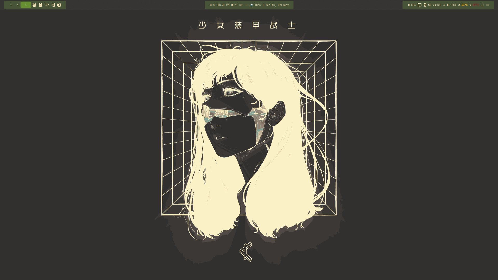
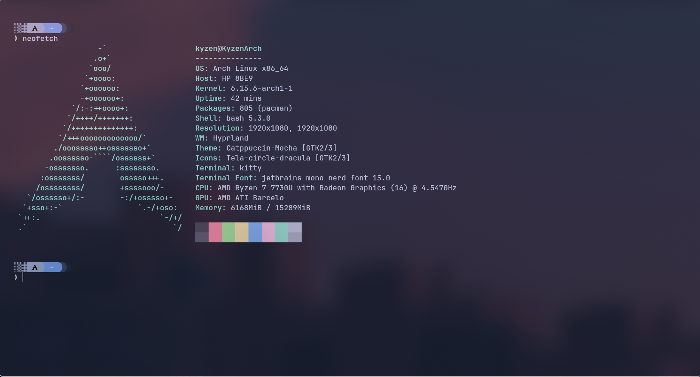

# Ricing My Workflow: Arch Linux + Hyprland Hyde

Ever since I first tried Linux, I’ve been hooked on how much control you get. My journey started with **Debian** — stable, clean, and easy to use. But after a while, I wanted something more:

- More **minimal**  
- More **secure**  
- More **customizable**

So naturally, I landed on **Arch Linux**.

---

## Why Hyprland Hyde?

I didn’t want to start my ricing journey completely from scratch — spending hours setting up configs and guessing which bar or compositor to use. That’s where **Hyprland Hyde** came in.

Hyde gave me:

- A **pre-configured desktop** to start from
- Clean, modular configs (no bloated rice mess)
- A beautiful tiling setup that I could tweak easily

I just opened the config files, changed a few keybindings, adjusted the wallpaper and layout, and **boom — my own custom desktop**.

---

## Tools I Use

Here’s my current workflow stack:

- **WM**: Hyprland  
- **Bar**: Waybar  
- **Terminal**: Alacritty  
- **Shell**: Zsh + Starship  
- **Launcher**: Rofi  
- **Theme**: Nord (for now)

---

## Screenshots

| **Main Desktop** Clean setup with Waybar & Hyprland | **Rofi Launcher** Minimal theme, fast app search |
|:--:|:--:|
|  |  |

| **Neofetch + Terminal** Starship prompt with Alacritty |
|:--:|
|  |

---

## Why I’m Sticking With It

- It boots fast  
- It uses barely any RAM  
- It looks great and keeps me focused  
- I know exactly **what’s running and why**

No bloat. Just my system, my config.

---

## What’s Next?

I’m thinking of:

- Adding **mako** for notifications  
- Trying **Foot terminal**  
- Creating a theme from scratch  
- Publishing my dotfiles when I feel confident

---

If you're thinking about switching to a riced Linux setup, I honestly recommend this path:  
**Arch + Hyprland Hyde** = great starting point + infinite customization potential.

