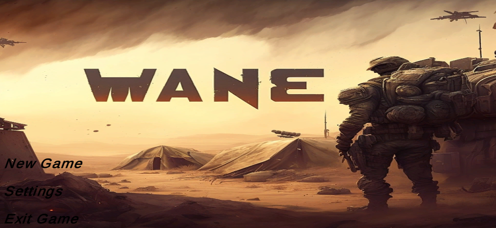
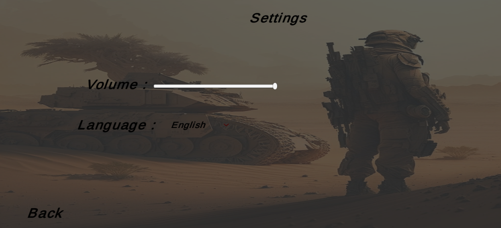

# Wane – A 2D Pixel Art Adventure Game

*Wane* is a 2D pixel art adventure game developed using the Unity engine and C#. In this game, you step into the boots of a lone soldier defending a mystical desert realm from relentless monsters.

## Development Overview

As the sole developer, I designed and built *Wane* from the ground up — coding, art, design, and mechanics. Every component, from fluid player controls to dynamic enemy behaviors, was carefully implemented to ensure a polished and responsive experience.

Key highlights include:

- **Character Movement**: Precise, responsive soldier movement using Unity’s input and physics systems.
- **Combat System**: Real-time swordplay with timed attacks, hit detection, and parry mechanics.
- **Art Style**: Handcrafted pixel environments inspired by desert landscapes, enhanced with fantasy elements. All assets were created using Photoshop.

## Screenshots

| **Home Screen**<br>Start of the adventure. | **Main Menu**<br>Clean UI with pixel aesthetic. |
|:--:|:--:|
|  |  |

| **Gameplay**<br>Engage with enemies in desert zones. |
|:--:|
|  |

## Code Sample: Enemy Spawner

```csharp
using UnityEngine;
using System.Collections;
using System.Collections.Generic;

public class EnemySpawner : MonoBehaviour
{
    public GameObject enemyPrefab;
    public float spawnInterval = 3f;
    public int maxEnemies = 5;
    public Transform[] spawnPoints;
    public float cooldownTime = 10f;

    private List<GameObject> activeEnemies = new List<GameObject>();
    private bool isCoolingDown = false;

    private void Start()
    {
        StartCoroutine(SpawnEnemies());
    }

    private IEnumerator SpawnEnemies()
    {
        while (true)
        {
            if (activeEnemies.Count < maxEnemies && !isCoolingDown)
            {
                Transform spawnPoint = spawnPoints[Random.Range(0, spawnPoints.Length)];
                GameObject enemy = Instantiate(enemyPrefab, spawnPoint.position, spawnPoint.rotation);
                activeEnemies.Add(enemy);
                yield return new WaitForSeconds(spawnInterval);
            }
            else
            {
                yield return null;
            }
        }
    }
}
